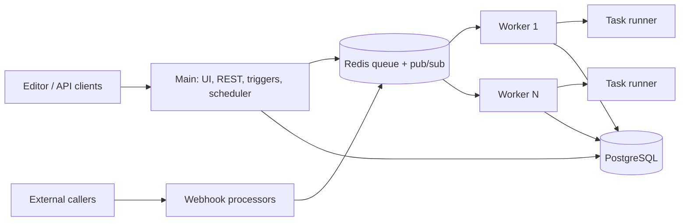
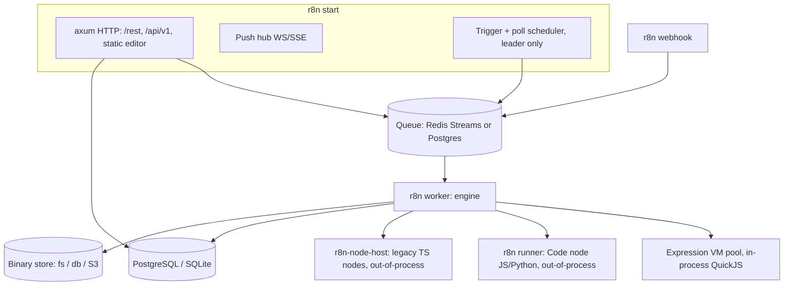

# n8n in Rust — Analysis, Review & Reimplementation Spec

Sep 25, 2026 · @Ivan Grunev

## 1. Summary

This spec defines a Rust reimplementation of n8n (working name **r8n**) that is behaviourally compatible with n8n: it imports and runs existing workflow JSON, exposes the same public REST API and webhook contract, and serves the same editor experience.

n8n is a fair-code workflow automation platform: a visual node canvas plus custom code, self-hosted or cloud, positioned today as a platform for AI agents. As of this review the repo has about 205k stars, 60.8k forks and 24.5k commits, is a pnpm + Turborepo TypeScript monorepo, and advertises 1500+ integrations and 9,000+ templates ([repo](https://github.com/n8n-io/n8n)).

The rewrite targets three gains n8n's Node.js runtime struggles with: lower memory per execution, predictable latency under load, and a hard sandbox boundary for user code. Parity is defined by a **compatibility test corpus** (section 8), not by line-by-line translation.

The biggest scope decision: the 1500+ integrations are not hand-ported on day one. The spec keeps a **compatibility bridge** that runs existing TypeScript node packages in an isolated JS runtime, while the top \~60 nodes by usage are ported natively. Everything else in the platform — engine, expressions, API, persistence, queue, auth, credentials — is native Rust.

## 2. Analysis of the current n8n

n8n is a TypeScript monorepo (pnpm workspaces + Turbo) with a Node.js/Express/TypeORM backend, a Vue 3/Vite/Pinia frontend, and a node-based execution engine; SQLite and PostgreSQL are the supported databases ([AGENTS.md](https://github.com/n8n-io/n8n/blob/master/AGENTS.md)).

### 2.1 Package map and Rust equivalents

| n8n package | Responsibility | Rust target |
| --- | --- | --- |
| `packages/workflow` | Workflow/node/connection types, graph traversal, expression evaluator, data proxy | `r8n-workflow` (types) + `r8n-expr` |
| `packages/core` | Execution engine, node execution contexts, binary data, credential helpers | `r8n-engine` + `r8n-binary` |
| `packages/cli` | Express server, REST + public API, CLI commands, DB, auth, queue, scaling | `r8n-server`, `r8n-api`, `r8n-db`, `r8n-queue`, `r8n-cli` |
| `packages/nodes-base` | Built-in integration nodes | `r8n-nodes-*` (native) + JS bridge |
| `packages/@n8n/nodes-langchain` | AI agent, LLM, memory, vector store, tool nodes | `r8n-ai` |
| `packages/@n8n/instance-ai` | In-editor AI assistant backend | Out of scope for v1 |
| `packages/@n8n/api-types` | Shared FE/BE contract types | `r8n-api-types` + generated TS via `ts-rs`/OpenAPI |
| `packages/editor-ui`, `@n8n/design-system`, `@n8n/i18n` | Vue editor, component library, UI strings | Reused as-is (see 4.3) |
| `@n8n/config`, `@n8n/di` | Env-driven config, IoC container | `r8n-config` (serde + env); DI replaced by explicit `AppState` |
| Task runner (`n8nio/runners`) | Isolated JS/Python Code node execution via a broker on port 5679 | `r8n-runner` (sandbox host) |

Backend patterns today: dependency injection via `@n8n/di`, controller-service-repository layering, an internal event bus, and context-based execution with a distinct context per node kind (AGENTS.md).

### 2.2 Runtime topology

One process can do everything: editor, webhooks, triggers and executions. In queue mode, a main instance and webhook processors push jobs to Redis, workers consume them, and PostgreSQL is the store. Each worker needs its own task-runner sidecar for Code nodes; main needs one only if it runs manual executions ([task runners docs](https://docs.n8n.io/hosting/configuration/task-runners/)). Worker concurrency defaults to 10 via `n8n worker --concurrency` ([queue mode guide](https://www.idir.ai/en/blog/scale-n8n-like-the-ultimate-guide-to-queue-mode-docker)).



### 2.3 Workflow model (the compatibility surface)

A workflow is JSON: `nodes[]` (id, name, type, typeVersion, position, parameters, credentials, disabled, retryOnFail, continueOnFail/onError, notes), `connections` keyed by **source node name** then connection type (`main`, `ai_tool`, `ai_languageModel`, `ai_memory`, …) then output index, plus `settings`, `staticData`, `pinData`, `meta` and tags. Connections are indexed by source, so parent lookups invert the map first (AGENTS.md).

### 2.4 Execution semantics to reproduce

- Data flows as arrays of **items** `{ json, binary?, pairedItem? }` per output; `pairedItem` links every output item to its source item, which powers `$('Node').item`.
- The engine keeps a node execution stack and a waiting map for multi-input nodes. Execution order `v1` (current default) runs branches depth-first in canvas order; legacy `v0` waits for all inputs. Both must be supported per workflow `settings.executionOrder`.
- Node kinds: regular `execute`, `trigger` (long-lived listener), `poll` (cron-driven), `webhook`, declarative routing nodes (HTTP described in JSON), and AI sub-nodes that `supplyData` (a model, memory or tool) to a root node over `ai_*` connections.
- Error model: per-node retry (`maxTries`, `waitBetweenTries`), `onError` = stop / continue / continue with error output, workflow-level error workflow, and Wait node resume (time, webhook, form) that persists state and resumes later.
- Results: `runData[nodeName][runIndex]` with timing, source, data and error, stored with the execution and replayed in the editor.
- Expressions: strings prefixed `=` with `{{ }}` blocks evaluated as JavaScript against a data proxy (`$json`, `$input`, `$('Node')`, `$node`, `$now`/`$today` via Luxon, `$workflow`, `$execution`, `$vars`, `$env`, `$jmespath`) plus n8n extension methods on strings, numbers, arrays, objects and dates.

### 2.5 Operational facts from 2.x

In 2.0, Python Code nodes run only on external task runners, ExecuteCommand and LocalFileTrigger are disabled by default, and in-memory binary data mode was removed in favour of filesystem (regular mode) or database (queue mode) storage ([v2.0 breaking changes](https://docs.n8n.io/2-0-breaking-changes/)). Bull's stalled-job retry and `QUEUE_WORKER_MAX_STALLED_COUNT` were also removed, so stalled jobs are no longer retried automatically ([changelog](https://docs.n8n.io/changelog/v20-breaking-changes)).

## 3. Review

n8n's product model is excellent and worth copying exactly; its runtime is where a Rust rewrite earns its keep. The review below is based on the public architecture, docs and issue tracker, not a full code audit.

### 3.1 Strengths to keep

- **Simple, durable data model.** Items-in, items-out with paired-item lineage makes every node composable and every run replayable.
- **Node description as data.** `INodeTypeDescription` (properties, display options, versions, credentials) drives the editor UI with no per-node frontend code. This is the single most important contract to preserve.
- **Versioned nodes.** `typeVersion` lets old workflows keep old behaviour while nodes evolve.
- **Declarative HTTP nodes.** Many integrations are pure JSON routing, which ports to Rust almost mechanically.
- **Progressive scaling.** Same binary runs single-process, queue mode, or multi-main.
- **Pin data and partial execution.** Fast build-test loops in the editor are a core UX differentiator.

### 3.2 Weaknesses and technical debt

| Area | Problem today | Consequence | Rust spec response |
| --- | --- | --- | --- |
| Memory | Whole `runData` and items held as JS objects in one heap | Large payloads OOM the process; workers sized for worst case | Streamed item batches, `Arc`-shared JSON, spill-to-disk above threshold |
| Concurrency | Single event loop per process; CPU-heavy nodes block webhooks | Latency spikes under load | Tokio multi-thread runtime; CPU nodes on `spawn_blocking` pool |
| Sandboxing | Expressions evaluated in-process; Code node isolation needed a separate runner service | Repeated sandbox-escape advisories; complex deployment | Expressions in a capability-limited embedded JS engine; Code node always out-of-process |
| Queue | Bull on Redis; stalled-job retry removed in 2.0 | At-most-once for stalled jobs, manual recovery | Lease-based jobs with heartbeats and idempotent resume |
| Config | Hundreds of env vars, some ignored in certain modes (e.g. broker listen address in queue mode, [#29742](https://github.com/n8n-io/n8n/issues/29742)) | Hard-to-debug deployments | One typed config schema, validated at boot, printed on `r8n config check` |
| Expression engine | JS semantics plus custom extension methods, tied to V8 behaviour | Hard to reimplement exactly | Embed a JS engine rather than write a new language (see 6.4) |
| Node packages | 1500+ nodes share one dependency tree and process | Upgrades are risky; community nodes can crash core | Nodes as isolated plugins with explicit ABI |
| Credentials crypto | CryptoJS-compatible AES with a single instance key | Key rotation is manual | Same format read/write for compat, plus envelope encryption and rotation |

### 3.3 Lessons for the rewrite

1. Treat the workflow JSON, node descriptions, public API and webhook URLs as **frozen contracts**; everything behind them may change.
2. Do not attempt to port every integration by hand before launch. A bridge buys parity; native ports buy performance where it matters.
3. Reuse the Vue editor. Rewriting the UI adds a year and gains nothing from Rust.
4. Make isolation the default, not an add-on sidecar.
5. Build the conformance suite before the engine: record real n8n executions and assert identical outputs.

## 4. Goals, non-goals and compatibility

r8n is done when an n8n 2.x user can point it at their database, keep their workflows, credentials and webhook URLs, and notice only that it is faster.

### 4.1 Goals

- **G1 Workflow compatibility:** import, run and export n8n workflow JSON unchanged, including `typeVersion` semantics, pin data and both execution orders.
- **G2 API compatibility:** public API `/api/v1/*` (API-key auth) and internal `/rest/*` used by the editor behave identically, including push events over WebSocket/SSE.
- **G3 Data compatibility:** read and migrate an existing n8n SQLite or PostgreSQL database, and decrypt existing credentials with the same `N8N_ENCRYPTION_KEY`.
- **G4 Deployment compatibility:** same env var names where they still make sense, same modes (single, queue, multi-main, webhook processor, worker), same default port 5678.
- **G5 Performance:** targets in section 8.
- **G6 Safety:** no user code or expression can reach the host process memory, filesystem or network except through declared capabilities.

### 4.2 Non-goals for v1

- The in-editor AI assistant (`instance-ai`) and n8n Cloud-specific services.
- Byte-identical internal database schema for new features; only migration from n8n is required.
- Hand-porting all 1500+ integrations before GA.
- A new visual editor.

### 4.3 Compatibility contracts

| Contract | Requirement | Verified by |
| --- | --- | --- |
| Workflow JSON | Round-trip without loss; unknown fields preserved in `extra` | Corpus of 9,000+ public templates |
| Node type description | Same `INodeTypeDescription` JSON served at `/types/nodes.json` so the Vue editor renders unchanged | Snapshot diff vs n8n |
| Expressions | Same result for the expression test corpus, including extension methods and Luxon formatting | Differential tests against n8n |
| Execution results | Same `runData` shape and item/pairedItem values | Recorded executions replayed |
| Webhooks | Same paths `/webhook/:path`, `/webhook-test/:path`, `/webhook-waiting/:id`, `/form/*` and response modes | HTTP golden tests |
| Credentials | Decrypt n8n-encrypted blobs; OAuth1/OAuth2 flows and token refresh identical | Migration tests on real DBs |
| Editor | Current n8n `editor-ui` build served as static assets, pinned to a tested n8n version | Playwright E2E suite from n8n |

Licensing matters for the editor reuse: n8n is distributed under the Sustainable Use License and the n8n Enterprise License ([repo](https://github.com/n8n-io/n8n)), so reusing its frontend or node code requires legal review (section 9).

## 5. Target architecture in Rust

r8n ships as one statically linked binary, `r8n`, whose role is chosen by subcommand (`start`, `worker`, `webhook`, `runner`), plus an optional `r8n-node-host` sidecar that runs legacy TypeScript nodes.

### 5.1 Process roles



In single mode all of these run inside one `r8n start` process except the runner and node host, which are always child processes managed by a supervisor.

### 5.2 Cargo workspace

| Crate | Contents | Depends on |
| --- | --- | --- |
| `r8n-workflow` | Serde types for workflow, node, connections, items, runData; graph utils; versioned JSON with `#[serde(flatten)] extra` | serde, serde\_json, indexmap |
| `r8n-expr` | Expression parser (`={{ }}` splitting), evaluator bridge, data proxy, extension library, Luxon-compatible bundle | rquickjs |
| `r8n-engine` | Scheduler, execution stack, v0/v1 ordering, retries, error outputs, wait/resume, sub-workflows, partial execution | r8n-workflow, r8n-expr, r8n-node-sdk |
| `r8n-node-sdk` | `Node` trait, `NodeDescription`, execution contexts, HTTP helpers, credential access, binary helpers; `#[node]` derive macro | async-trait, reqwest |
| `r8n-nodes-core` | Native core nodes (section 6.6) | r8n-node-sdk |
| `r8n-nodes-declarative` | Interpreter for n8n declarative (routing) node JSON | r8n-node-sdk |
| `r8n-bridge` | JSON-RPC over Unix socket to `r8n-node-host`; shims `IExecuteFunctions` callbacks | tokio, serde |
| `r8n-ai` | Agent loop, model providers, memory, tools, vector stores, MCP client/server | reqwest, rmcp, qdrant-client, pgvector |
| `r8n-credentials` | CryptoJS-compatible AES, envelope keys, OAuth1/2, credential tests | aes, cbc, md-5, oauth2 |
| `r8n-db` | Repositories, migrations incl. import from n8n schema | sqlx (postgres, sqlite) |
| `r8n-queue` | Job lease/heartbeat/ack; Redis Streams and Postgres `SKIP LOCKED` backends; pub/sub for multi-main | fred, sqlx |
| `r8n-binary` | Binary data store: filesystem, database, S3 | object\_store |
| `r8n-api` | Handlers for `/rest` and `/api/v1`, OpenAPI | axum, utoipa |
| `r8n-auth` | Sessions (JWT cookie), bcrypt, MFA/TOTP, API keys, LDAP, SAML, OIDC, RBAC | jsonwebtoken, bcrypt, totp-rs, ldap3, samael, openidconnect |
| `r8n-runner` | Sandboxed Code node host: V8 isolates for JS, CPython subprocess for Python | deno\_core, nix (seccomp/rlimits) |
| `r8n-config` | Typed config from env/files with n8n var aliases | figment |
| `r8n-telemetry` | Logs, metrics, traces, log streaming destinations | tracing, opentelemetry, metrics |
| `r8n-cli` | Binary entry, subcommands, import/export, `migrate-from-n8n` | clap |

### 5.3 Key technology decisions

- **Async runtime:** Tokio multi-threaded. Node `execute` futures are `Send`; CPU-bound work (XML, crypto, spreadsheets) uses `spawn_blocking`.
- **HTTP:** axum + tower middleware (auth, rate limit, body limits, tracing). reqwest with rustls for outbound; a shared SSRF-guard resolver blocks private ranges unless allowed.
- **Expressions:** QuickJS via `rquickjs`, one pre-warmed context pool per worker with 64 MB heap cap and an instruction-count interrupt. QuickJS starts in under 1 ms and runs the same JS as n8n expressions.
- **Code node:** V8 via `deno_core` in the separate `r8n runner` process for JS (npm allow-list resolved at build time), CPython subprocess for Python; both under seccomp, cgroups and no network by default.
- **Legacy nodes:** `r8n-node-host` is a thin Node.js program that loads `n8n-nodes-base` and community packages and forwards every helper call (HTTP, credentials, binary) back to Rust, so secrets never live in the JS process longer than a call.
- **Future plugin ABI:** third-party native nodes as WebAssembly components (wasmtime + WIT interface mirroring `r8n-node-sdk`). Not required for v1.
- **Database:** sqlx with compile-time checked queries; PostgreSQL primary, SQLite for single-node.

## 6. Functional specification

Each subsystem below lists what r8n must do; "MUST" items are required for GA, "SHOULD" items may follow.

### 6.1 Workflow model

```rust
#[derive(Serialize, Deserialize, Clone)]
#[serde(rename_all = "camelCase")]
pub struct Workflow {
    pub id: Option<String>,
    pub name: String,
    pub active: bool,
    pub nodes: Vec<Node>,
    pub connections: IndexMap<String, NodeConnections>, // by source node name
    pub settings: WorkflowSettings,  // executionOrder, timezone, errorWorkflow, saveData*, callerPolicy
    pub static_data: Option<Value>,
    pub pin_data: Option<IndexMap<String, Vec<Item>>>,
    pub version_id: Option<String>,
    #[serde(flatten)] pub extra: Map<String, Value>, // preserve unknown fields
}
pub type NodeConnections = IndexMap<ConnectionType, Vec<Vec<Connection>>>; // output index -> targets
pub struct Item { pub json: Value, pub binary: Option<IndexMap<String, BinaryRef>>, pub paired_item: Option<PairedItem> }
```

- MUST keep node names as the connection key, rename-propagate names into expressions like n8n does, and preserve key order on export.
- MUST validate on save: unknown node types allowed but flagged; cycles allowed (loops are legal).

### 6.2 Execution engine

1. Build the start set: trigger node, webhook node, a manual start node, or the destination for partial execution ("run up to node X", reusing prior `runData` and pin data).
2. Maintain `node_execution_stack: VecDeque<ExecuteData>` and `waiting: HashMap<NodeName, HashMap<RunIndex, Vec<Option<Items>>>>`.
3. Pop, resolve parameters (expressions per item), call the node, record `TaskData` (startTime, executionTime, source, data, error), push children per output.
4. Ordering: `v1` pushes children to the front in canvas position order (depth-first per branch); `v0` enqueues and waits for all inputs of multi-input nodes.
5. Honour node flags: `disabled` (pass-through), `alwaysOutputData`, `executeOnce`, `retryOnFail` with `maxTries` and `waitBetweenTries`, `onError`.
6. On `Wait` or form/webhook resume: persist full state (stack, waiting, runData) with status `waiting` and `waitTill`; a resumer picks it up later on any worker.
7. Sub-workflows: Execute Workflow node runs a child execution, synchronously or fire-and-forget, with `callerPolicy` enforcement.
8. Cancellation: cooperative via `CancellationToken` checked between nodes and inside HTTP helpers; hard timeout per `settings.executionTimeout`.
9. Hooks: `workflowExecuteBefore/After`, `nodeExecuteBefore/After` events emitted to the push hub, event bus, and log streaming.

### 6.3 Triggers, webhooks and schedules

- **Webhooks:** axum router over the `webhook_entity` table; static and dynamic paths (`:param`), methods, response modes (`onReceived`, `lastNode`, `responseNode`), binary bodies, CORS options, basic/header/JWT auth. Test webhooks registered for 120 s while the editor listens.
- **Polling:** cron expressions per node evaluated in workflow timezone; leader-only in multi-main.
- **Long-lived triggers:** e.g. IMAP, MQTT, Kafka, RabbitMQ, Postgres LISTEN run as supervised Tokio tasks on the leader with restart backoff.
- **Forms and chat:** `/form/*` and chat trigger endpoints render the same HTML/JSON as n8n.
- **Activation:** activating a workflow registers webhooks with third-party services (webhook `checkExists`/`create`/`delete` methods) and persists IDs in `staticData`.

### 6.4 Expressions

- MUST split parameter strings starting with `=` into literal and `{{ … }}` segments; a single segment returns its native type, mixed segments stringify.
- MUST evaluate in QuickJS with a data proxy built lazily from Rust: `$json`, `$binary`, `$input.all()/first()/last()/item`, `$('Node').item/all()/first()/pairedItem()`, `$node`, `$prevNode`, `$runIndex`, `$itemIndex`, `$workflow`, `$execution` (id, mode, resumeUrl, customData), `$vars`, `$env` (blockable), `$now`, `$today`, `$jmespath`, `$fromAI` for tool parameters.
- MUST ship the n8n extension methods (e.g. string `toSnakeCase`, `extractEmail`; array `pluck`, `unique`; date `format`, `plus`) and Luxon, bundled as a JS snapshot loaded into each context.
- MUST deny `Function` constructor escapes, prototype access to host objects, `process`, `require` and timers; limit per-expression time to 1 s by default.
- SHOULD offer a fast path: simple `{{ $json.a.b }}` paths are resolved in Rust without entering the VM.

### 6.5 Credentials

- Storage: `credentials_entity.data` is an encrypted string compatible with CryptoJS AES (OpenSSL `Salted__` header, EVP\_BytesToKey MD5 derivation) keyed by `N8N_ENCRYPTION_KEY`. r8n MUST read this format and SHOULD write a versioned envelope format (`r8n:v1:` + AES-256-GCM with per-record data key) once migration is confirmed.
- Types: credential type descriptions (properties, `authenticate` rules, `test` request, `preAuthentication`) served to the editor exactly as n8n does.
- OAuth1/OAuth2 authorization-code, client-credentials and PKCE flows with callback at `/rest/oauth2-credential/callback`; automatic refresh on 401.
- External secrets providers (Vault, AWS Secrets Manager, Azure Key Vault, GCP, Infisical) resolved via `{{ $secrets.provider.key }}`.
- Access control: credentials are shared with projects; a node may only use credentials its workflow's project can access.

### 6.6 Node SDK and nodes

```rust
#[async_trait]
pub trait NodeType: Send + Sync {
    fn description(&self) -> &NodeDescription;             // serialises to INodeTypeDescription
    async fn execute(&self, ctx: &mut ExecuteContext) -> NodeResult<Vec<Vec<Item>>> { unimplemented!() }
    async fn poll(&self, ctx: &mut PollContext) -> NodeResult<Option<Vec<Vec<Item>>>> { unimplemented!() }
    async fn trigger(&self, ctx: TriggerContext) -> NodeResult<TriggerHandle> { unimplemented!() }
    async fn webhook(&self, ctx: &mut WebhookContext) -> NodeResult<WebhookResponse> { unimplemented!() }
    async fn supply_data(&self, ctx: &mut SupplyDataContext) -> NodeResult<SuppliedData> { unimplemented!() }
    fn methods(&self) -> NodeMethods { NodeMethods::default() }   // loadOptions, listSearch, resourceMapping, credentialTest
}
```

- Contexts expose `get_node_parameter(name, item_index)`, `get_credentials(type)`, `http_request_with_authentication`, `binary.prepare/get_buffer/get_stream`, `continue_on_fail()`, `send_message_to_ui`, `get_workflow_static_data`.
- Node registry resolves `type` + `typeVersion` to: native Rust node, declarative interpreter, or bridge. Resolution order is configurable per node type.
- **Native at GA (about 60):** Manual/Schedule/Webhook/Form/Chat/Error/Execute Workflow triggers; HTTP Request (v4); Code; Set/Edit Fields; If; Switch; Filter; Merge; Loop Over Items (SplitInBatches v3); Split Out; Aggregate; Summarize; Sort; Limit; Remove Duplicates; Compare Datasets; Wait; Respond to Webhook; Execute Workflow; No-Op; Stop and Error; Date & Time; Crypto; XML; HTML; Markdown; JWT; Compression; Extract from File / Convert to File; Read/Write Files; Send Email/IMAP; FTP/SFTP; SSH; Postgres; MySQL; MSSQL; MongoDB; Redis; Data Tables; RabbitMQ; Kafka; MQTT; Slack; Google Sheets; Gmail; Google Drive; Notion; Airtable; GitHub; Telegram; Discord; OpenAI; the AI cluster nodes in 6.8.
- **Everything else:** declarative interpreter where possible, otherwise bridge. Community node packages installed via `/rest/community-packages` always run in the bridge.

### 6.7 Code node

- JavaScript "Run once for all items" and "Run once for each item" modes with `$input`, `$json`, `items`, `$()` and `console.log` forwarded to the editor.
- Python native mode matching n8n 2.x semantics (no Pyodide built-ins).
- Executed in `r8n runner` over a local broker socket; the runner receives only the data the task needs and returns items. Defaults: 256 MB memory, 60 s timeout, no network, allow-listed stdlib/npm modules (`NODE_FUNCTION_ALLOW_BUILTIN`, `NODE_FUNCTION_ALLOW_EXTERNAL`, `N8N_RUNNERS_STDLIB_ALLOW` aliases).

### 6.8 AI and agents

- Root nodes: AI Agent (tools agent loop with max iterations, structured output, streaming), Basic LLM Chain, Question and Answer Chain, Summarization, Information Extractor, Text Classifier, Sentiment Analysis.
- Sub-nodes over `ai_*` connections: chat models (OpenAI, Anthropic, Google, Azure OpenAI, Mistral, Groq, Ollama, Bedrock, OpenRouter), embeddings, memory (window buffer, Postgres, Redis), vector stores (in-memory, PGVector, Qdrant, Pinecone, Supabase), document loaders, text splitters, output parsers, tools (Workflow Tool, HTTP Request Tool, Code Tool, any node as tool via `$fromAI`).
- MCP: MCP Client Tool node and MCP Server Trigger, via the `rmcp` crate.
- Agent steps stored as sub-runs in `runData` with the same `ai_*` input/output shape the editor's AI log view expects; token usage recorded per call.
- The LangChain JS object model is not reproduced; only the observable inputs, outputs and logs are.

### 6.9 APIs and push

- `/rest/*`: every endpoint the pinned editor build calls (workflows, executions, credentials, node types, users, projects, folders, tags, variables, data tables, settings, community packages, source control, insights, evaluations). Generated from a recorded route inventory of the pinned n8n version.
- `/api/v1/*`: public API (workflows, executions, credentials, tags, users, projects, variables, source control pull, audit) with `X-N8N-API-KEY` and scopes; OpenAPI served at `/api/v1/docs`.
- Push: `/rest/push` over WebSocket (SSE fallback) sending `executionStarted`, `nodeExecuteBefore`, `nodeExecuteAfter`, `executionFinished`, `workflowActivated` and related messages in n8n's JSON format; in multi-main, relayed via pub/sub.
- Health: `/healthz`, `/healthz/readiness`, `/metrics` (Prometheus, `n8n_` metric names aliased).

### 6.10 Users, projects and enterprise features

- Roles: global owner/admin/member; project admin/editor/viewer; custom roles with scope strings (`workflow:read`, `credential:share`, …) matching n8n's scope names.
- Personal and team projects owning workflows, credentials and folders; sharing tables `shared_workflow`, `shared_credentials`.
- Auth: email/password (bcrypt), TOTP MFA with recovery codes, SAML, OIDC, LDAP sync, invite links, password reset via SMTP.
- SHOULD at GA: Git-based source control (push/pull environments), external secrets, log streaming (webhook, syslog, Sentry), workflow history, audit, insights dashboard, evaluations.

### 6.11 Editor delivery

r8n serves the compiled n8n `editor-ui` assets from a pinned version, injecting settings through `/rest/settings` exactly as n8n does. A contract test fails the build if the editor calls an endpoint r8n does not implement.

## 7. Data model, persistence and scaling

r8n keeps n8n's table names and column meanings so an existing database migrates in place; new tables use an `r8n_` prefix.

### 7.1 Core tables

| Table | Key columns | Notes |
| --- | --- | --- |
| `workflow_entity` | id, name, active, nodes (json), connections (json), settings, staticData, pinData, versionId, parentFolderId, triggerCount | Hot path for activation; JSON columns kept as JSON/JSONB |
| `workflow_history` | versionId, workflowId, nodes, connections, authors, createdAt | Append-only |
| `execution_entity` | id, workflowId, status, mode, startedAt, stoppedAt, waitTill, retryOf, finished | Indexed on (workflowId, startedAt) and (status, waitTill) |
| `execution_data` | executionId, workflowData, data | `data` uses n8n's flatted serialisation on read; r8n writes compressed JSON with a format marker |
| `execution_metadata` | executionId, key, value | Custom data from `$execution.customData` |
| `credentials_entity` | id, name, type, data (encrypted), isManaged | See 6.5 |
| `shared_workflow`, `shared_credentials` | resource id, projectId, role | Sharing |
| `project`, `project_relation`, `user`, `role`, `scope` |  | RBAC |
| `webhook_entity` | workflowId, webhookPath, method, node, webhookId, pathLength | Router source of truth |
| `tag_entity`, `folder`, `variables`, `settings`, `installed_packages`, `installed_nodes` |  |  |
| `data_table` + per-table storage |  | Data Tables feature |
| `r8n_job` | id, executionId, state, leaseUntil, attempts, workerId | Only for the Postgres queue backend |

Migration: `r8n migrate-from-n8n --db <url>` checks the n8n migration table for a supported version (pinned range 2.x), applies r8n's additive migrations, and never drops n8n columns, so rollback to n8n stays possible during the pilot.

### 7.2 Execution data storage

- Save policy per workflow: `saveDataErrorExecution`, `saveDataSuccessExecution`, `saveManualExecutions`, `saveExecutionProgress`.
- Pruning: age (`EXECUTIONS_DATA_MAX_AGE`, default 336 h) and count (`EXECUTIONS_DATA_PRUNE_MAX_COUNT`), soft-delete then hard-delete with binary cleanup.
- Binary data: filesystem (default in single mode), database (default in queue mode) or S3, referenced by `BinaryRef { id, mimeType, fileName, fileSize }`, streamed rather than buffered.

### 7.3 Queue mode

| Concern | n8n today | r8n |
| --- | --- | --- |
| Broker | Bull on Redis | Redis Streams consumer groups (default) or Postgres `SKIP LOCKED` (no Redis needed) |
| Delivery | Job picked once; stalled jobs no longer retried in 2.0 | Lease with 30 s heartbeat; expired lease re-queued; engine resumes from last persisted node when `saveExecutionProgress` is on |
| Concurrency | `--concurrency` default 10 | Same flag; plus per-workflow and global production limits |
| Webhook processors | Separate `webhook` processes enqueue jobs | Same; can also run `lastNode` responses by awaiting job result over pub/sub |
| Multi-main | Leader election via Redis for triggers and pruning | Same via Redis lock or Postgres advisory lock |
| Manual executions | Optional offload to workers | Offloaded by default; push events relayed via pub/sub |

### 7.4 Scaling targets

One worker process SHOULD sustain 10x n8n's executions per second for a 5-node HTTP-and-transform workflow on the same hardware (verified in section 8), and horizontal scaling is linear until the database saturates.

## 8. Non-functional requirements

Every target below is measured against n8n on identical hardware (4 vCPU, 8 GB, PostgreSQL 16) using the same workflow; the numbers are proposed targets to confirm in a Phase 0 baseline.

### 8.1 Performance and footprint

| Metric | Target |
| --- | --- |
| Idle memory, single mode, no bridge | ≤ 60 MB RSS |
| Cold start to ready | ≤ 1 s (excluding migrations) |
| Webhook → response, `onReceived`, p99 at 500 rps | ≤ 15 ms |
| Throughput, 5-node native workflow, one worker | ≥ 10x n8n |
| Simple expression `{{ $json.a }}` | ≤ 2 µs (fast path) |
| Complex expression in VM | ≤ 50 µs p50 |
| Peak memory for 100k-item Set node run | ≤ 3x payload size |
| Container image | ≤ 80 MB without node host; ≤ 400 MB with |

### 8.2 Security

- Threat model covers: malicious workflow authors in multi-tenant setups, malicious community nodes, hostile webhook callers, SSRF from HTTP nodes.
- Code node and bridge run as separate OS processes, unprivileged user, seccomp profile, read-only root, no network unless allowed, cgroup memory/CPU limits.
- Expression VM has no host bindings except the read-only data proxy.
- `#![forbid(unsafe_code)]` in all crates except vetted FFI wrappers; `cargo deny` and `cargo audit` in CI.
- Secrets zeroised after use (`zeroize`), never logged; credential data redacted from execution data and error messages.
- Dangerous nodes (Execute Command, Local File Trigger) disabled by default, matching n8n 2.0.
- Rate limits and body size limits on all public endpoints; auth cookies `HttpOnly`, `SameSite=Lax`, `Secure` behind TLS.

### 8.3 Reliability

- No execution silently lost: every accepted production execution ends in `success`, `error`, `canceled` or `crashed`, never stuck in `running` after a worker dies.
- Graceful shutdown: stop accepting jobs, finish or checkpoint in-flight executions within `N8N_GRACEFUL_SHUTDOWN_TIMEOUT` (default 30 s).
- Crash recovery on boot marks orphaned executions and re-queues leased jobs.

### 8.4 Observability

- Structured JSON logs via `tracing`, with execution id, workflow id and node name as span fields.
- OpenTelemetry traces: one trace per execution, one span per node run, outbound HTTP spans.
- Prometheus metrics compatible with n8n's names plus queue depth, lease expiries, VM pool usage.
- Log streaming destinations: webhook, syslog, Sentry.

### 8.5 Testing strategy

1. **Conformance corpus:** run each workflow in n8n and r8n with recorded HTTP (VCR-style fixtures), compare `runData` item by item. Sources: n8n's JSON workflow tests, public templates, customer-donated anonymised workflows.
2. **Expression differential fuzzing:** generate expressions and data, evaluate in n8n (via Node) and r8n, diff results.
3. **Node unit tests:** port n8n's per-node tests (Vitest + nock) to Rust with `wiremock`.
4. **Editor E2E:** run n8n's Playwright suite against r8n.
5. **Property tests** (`proptest`) on the engine: ordering invariants, pairedItem integrity, resume-after-crash equivalence.
6. **Load tests** with k6 on each release; regressions over 10% block release.

GA gate: 99% of the conformance corpus passes, 100% of the top-60-node tests pass, and the Playwright suite is green.

## 9. Roadmap, risks and open questions

The plan reaches a usable single-node beta in about 9 months and GA parity in about 18 months with a team of 8–10 Rust engineers; durations are estimates to refine after Phase 0.

### 9.1 Phases

| Phase | Duration | Deliverables | Exit gate |
| --- | --- | --- | --- |
| 0. Baseline | 6 weeks | Conformance harness, recorded corpus, n8n benchmark numbers, route inventory of pinned editor | Harness reproduces n8n results on 500 workflows |
| 1. Core | 3 months | `r8n-workflow`, `r8n-expr`, `r8n-engine`, 15 core nodes, SQLite, CLI `execute` | 80% of logic-only corpus passes headless |
| 2. Server | 3 months | axum API, auth, push, webhooks, schedules, credentials + OAuth, editor served | Editor usable end to end; Playwright smoke green |
| 3. Beta | 2 months | Bridge node host, Code runner (JS/Python), Postgres, migration from n8n | Pilot users run a copied n8n DB in parallel |
| 4. Scale | 3 months | Queue mode, multi-main, binary S3, observability, 60 native nodes | Load targets in 8.1 met |
| 5. GA | 3 months | AI cluster nodes, MCP, RBAC/projects, SSO, source control, external secrets | GA gate in 8.5 |

### 9.2 Risks

| Risk | Likelihood | Impact | Mitigation |
| --- | --- | --- | --- |
| Expression semantics drift (JS edge cases, Luxon, extension methods) | High | High | Run real JS in QuickJS; differential fuzzing; ship n8n's extension source as the bundle |
| Licensing blocks reuse of editor, nodes or credential descriptions | Medium | Very high | Legal review in Phase 0; fallback is a new editor, which adds 9–12 months |
| Editor contract churn as n8n ships weekly | High | Medium | Pin one n8n version per r8n release; generated route inventory diff |
| Bridge overhead cancels performance gains | Medium | Medium | Port nodes by usage telemetry; batch IPC calls per item set |
| AI node parity (LangChain behaviours) | Medium | Medium | Match observable I/O only; start with Agent + 5 providers |
| Team hiring for Rust + domain knowledge | Medium | High | Pair contributors familiar with n8n internals with Rust leads |

### 9.3 Licensing

n8n is fair-code under the Sustainable Use License, with enterprise features under the separate n8n Enterprise License ([repo](https://github.com/n8n-io/n8n)). A clean-room reimplementation of behaviour and public interfaces is a different legal question from copying code, UI assets, node descriptions or enterprise features. This spec assumes legal sign-off before any n8n source, assets or `.ee` code are reused, and that r8n's own license is chosen by then. This is not legal advice.

### 9.4 Open questions

- Is r8n intended as a drop-in replacement for existing n8n users, or a new product that only needs import compatibility?
- Which n8n minor version is the first compatibility pin?
- Is the Node.js bridge acceptable in the shipped product, or must v1 be 100% Rust at runtime?
- Which enterprise features (SSO, source control, log streaming) are in scope for GA versus later?
- Which usage data decides the native-node priority list beyond the proposed 60?

### Sources

- [n8n repository README](https://github.com/n8n-io/n8n)
- [n8n AGENTS.md (architecture, packages, stack)](https://github.com/n8n-io/n8n/blob/master/AGENTS.md)
- [n8n v2.0 breaking changes](https://docs.n8n.io/2-0-breaking-changes/)
- [n8n changelog: v2.0 breaking changes](https://docs.n8n.io/changelog/v20-breaking-changes)
- [n8n task runners documentation](https://docs.n8n.io/hosting/configuration/task-runners/)
- [Queue mode, workers and task runners guide](https://www.idir.ai/en/blog/scale-n8n-like-the-ultimate-guide-to-queue-mode-docker)
- [Issue #29742: broker listen address ignored in queue mode](https://github.com/n8n-io/n8n/issues/29742)

Details of engine internals, table columns and node APIs not covered by these sources come from general knowledge of the n8n codebase and should be verified against the pinned version in Phase 0.
